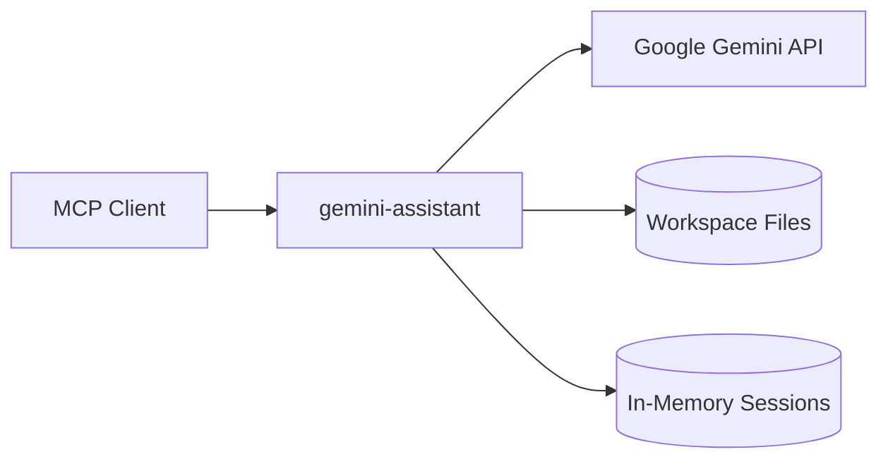

# Gemini Assistant

[](https://github.com/j0hanz/gemini-assistant/blob/master/LICENSE) [](https://github.com/j0hanz/gemini-assistant/blob/master/package.json) [](https://github.com/j0hanz/gemini-assistant/stargazers) [](https://github.com/j0hanz/gemini-assistant/commits)

[](https://nodejs.org) [](https://www.typescriptlang.org)

An MCP server implementation on top of the Google Gemini API, with a fixed public surface of tools and prompts, server-managed sessions and workspace context caching.

## Overview

`gemini-assistant` implements the [Model Context Protocol](https://modelcontextprotocol.io) v2 on top of the Google Gemini API. It provides a fixed public surface of four tools, three prompts, and a set of resources, with server-managed sessions, workspace context caching, and streaming support built in.

| Aspect       | Details                  |
| :----------- | :----------------------- |
| **Status**   | Active                   |
| **Language** | TypeScript (strict, ESM) |
| **Runtime**  | Node.js `>=24`           |
| **Package**  | npm                      |
| **License**  | MIT                      |

## Highlights

| Feature                 | Description                                                                              |
| :---------------------- | :--------------------------------------------------------------------------------------- |
| Job-first surface       | Four purpose-built tools (`chat`, `research`, `analyze`, `review`) with a fixed contract |
| Server-managed sessions | In-memory multi-turn chat history with replay-safe `Part[]` per turn                     |
| Workspace context cache | Auto-scans local files and caches the assembled context for Gemini calls                 |
| Multiple transports     | Stdio (default), HTTP with bearer auth and rate limiting, and web-standard               |

## Built With

[](https://nodejs.org) [](https://www.typescriptlang.org)

| Layer            | Technology                                |
| :--------------- | :---------------------------------------- |
| AI               | `@google/genai` — Google Gemini SDK       |
| MCP              | `@modelcontextprotocol/server` v2 alpha   |
| HTTP transport   | Express v5                                |
| Schema / parsing | Zod v4, `@cfworker/json-schema`           |
| Tooling          | TypeScript strict, ESLint, Prettier, Knip |

## Quick Start

> [!TIP]
> Get running in under 60 seconds. Requires Node.js `>=24` and a Google Gemini API key.

### Prerequisites

| Requirement       | Version / Notes                                             |
| :---------------- | :---------------------------------------------------------- |
| Node.js           | `>=24`                                                      |
| Google Gemini key | Obtain from [Google AI Studio](https://aistudio.google.com) |

### Install

```bash
git clone https://github.com/j0hanz/gemini-assistant.git
cd gemini-assistant
npm install
```

Create a `.env` file in the project root:

```env
API_KEY=your_gemini_api_key_here
```

```bash
npm run build
```

### Verify

```bash
node --env-file=.env dist/index.js
```

```text
gemini-assistant MCP server running on stdio
```

## Usage

### stdio (Claude Desktop / Claude Code)

Add to your MCP client configuration:

```json
{
  "mcpServers": {
    "gemini-assistant": {
      "command": "node",
      "args": ["/path/to/gemini-assistant/dist/index.js"],
      "env": {
        "API_KEY": "your_gemini_api_key_here"
      }
    }
  }
}
```

### HTTP transport

```bash
TRANSPORT=http MCP_HTTP_TOKEN=your_32char_token_here PORT=3000 node --env-file=.env dist/index.js
```

### Tools

| Tool       | Best For                                                      |
| :--------- | :------------------------------------------------------------ |
| `chat`     | Multi-turn conversational tasks with optional server sessions |
| `research` | Web-grounded lookups — `mode=quick` or `mode=deep`            |
| `analyze`  | Bounded analysis of one file, multiple files, or public URLs  |
| `review`   | Diff review, file comparison, or failure triage               |

### Prompts

| Prompt     | Purpose                                             |
| :--------- | :-------------------------------------------------- |
| `discover` | Orient a client to the public surface               |
| `research` | Package a research goal into the quick/deep flow    |
| `review`   | Frame a diff review, comparison, or failure request |

### Architecture



## Project Structure

```text
gemini-assistant/
├── __tests__/
│   └── lib/
├── src/
│   ├── lib/
│   ├── schemas/
│   ├── tools/
│   ├── catalog.ts
│   ├── client.ts
│   ├── config.ts
│   ├── index.ts
│   ├── prompts.ts
│   ├── public-contract.ts
│   ├── resources.ts
│   ├── server.ts
│   ├── sessions.ts
│   └── transport.ts
└── package.json
```

| Path                     | Purpose                                                   |
| :----------------------- | :-------------------------------------------------------- |
| `src/index.ts`           | Process bootstrap, signal handling, transport dispatch    |
| `src/server.ts`          | MCP server wiring — tools, prompts, and resources         |
| `src/public-contract.ts` | Canonical public surface definition (frozen contract)     |
| `src/tools/`             | One `registerXxxTool()` function per public job           |
| `src/sessions.ts`        | In-memory session storage with replay-safe `Part[]`       |
| `src/schemas/`           | Zod v4 input/output schemas and validators                |
| `src/lib/`               | Shared infrastructure: orchestration, streaming, response |
| `src/config.ts`          | All env-var parsing                                       |
| `src/transport.ts`       | HTTP and web-standard transport setup                     |
| `__tests__/`             | Unit and e2e tests mirroring `src/`                       |

## Configuration

> [!IMPORTANT]
> `API_KEY` is the **only required** variable. Every other setting has a safe default and is grouped by concern below.

```env
# Required
API_KEY=your_gemini_api_key_here
```

### Core

| Variable | Default                  | Purpose             |
| :------- | :----------------------- | :------------------ |
| `MODEL`  | `gemini-3-flash-preview` | Gemini model to use |

### Transport & HTTP

| Variable                                  | Default     | Purpose                                         |
| :---------------------------------------- | :---------- | :---------------------------------------------- |
| `TRANSPORT`                               | `stdio`     | Transport mode: `stdio`, `http`, `web-standard` |
| `MCP_HTTP_TOKEN`                          | —           | Bearer token for HTTP transport (≥32 chars)     |
| `PORT`                                    | `3000`      | HTTP listen port                                |
| `HOST`                                    | `127.0.0.1` | HTTP bind host                                  |
| `CORS_ORIGIN`                             | —           | Allowed CORS origin for HTTP transport          |
| `MCP_TRUST_PROXY`                         | `false`     | Trust `X-Forwarded-*` headers                   |
| `MCP_ALLOW_UNAUTHENTICATED_LOOPBACK_HTTP` | `false`     | Allow unauthenticated loopback HTTP (dev only)  |
| `MCP_HTTP_RATE_LIMIT_RPS`                 | `10`        | HTTP rate limit — requests per second           |
| `MCP_HTTP_RATE_LIMIT_BURST`               | `20`        | HTTP rate limit — burst allowance               |

### Sessions & capabilities

| Variable                       | Default | Purpose                                              |
| :----------------------------- | :------ | :--------------------------------------------------- |
| `STATELESS`                    | `false` | Disable sessions and tasks capability                |
| `THOUGHTS`                     | `false` | Expose model thinking parts in responses             |
| `MCP_EXPOSE_SESSION_RESOURCES` | `false` | Expose transcript, events, and turn-parts resources  |
| `GEMINI_SESSION_REDACT_KEYS`   | —       | Comma-separated regex patterns for session redaction |

### Workspace & context

| Variable             | Default | Purpose                                            |
| :------------------- | :------ | :------------------------------------------------- |
| `CACHE`              | `true`  | Enable workspace context cache                     |
| `CACHE_TTL`          | `3600s` | Workspace cache TTL (e.g. `1800s`)                 |
| `AUTO_SCAN`          | `true`  | Auto-scan workspace files on startup               |
| `ROOTS`              | —       | Comma-separated workspace root paths               |
| `ROOTS_FALLBACK_CWD` | `false` | Fall back to CWD when no roots are configured      |
| `CONTEXT`            | —       | Path to a workspace context override file          |
| `REVIEW_DOCS`        | —       | Comma-separated paths to docs injected into review |

### Gemini limits & safety

| Variable                     | Default  | Purpose                                        |
| :--------------------------- | :------- | :--------------------------------------------- |
| `GEMINI_MAX_OUTPUT_TOKENS`   | `2048`   | Maximum output tokens per call (max 1 048 576) |
| `GEMINI_THINKING_BUDGET_CAP` | `16384`  | Thinking token budget cap                      |
| `CHAT_MESSAGE_MAX_CHARS`     | `100000` | Maximum characters for a chat message          |
| `GEMINI_SAFETY_SETTINGS`     | —        | JSON array of Gemini safety setting overrides  |

### Logging

| Variable        | Default | Purpose                                |
| :-------------- | :------ | :------------------------------------- |
| `LOG_DIR`       | —       | Directory for log files                |
| `LOG_TO_STDERR` | `false` | Write logs to stderr instead of a file |
| `LOG_PAYLOADS`  | `false` | Enable verbose Gemini payload logging  |

## Scripts

| Command                | Description                                                |
| :--------------------- | :--------------------------------------------------------- |
| `npm run build`        | Compile TypeScript to `dist/`                              |
| `npm start`            | Start the compiled server                                  |
| `npm test`             | Run the full test suite via Node's built-in test runner    |
| `npm run lint`         | ESLint — zero warnings allowed                             |
| `npm run lint:fix`     | ESLint with auto-fix                                       |
| `npm run format`       | Prettier write                                             |
| `npm run format:check` | Prettier check                                             |
| `npm run type-check`   | TypeScript type-check without emitting files               |
| `npm run knip`         | Dead-code and unused-export check                          |
| `npm run check:static` | Build + type-check + lint + format check + knip            |
| `npm run check`        | All static checks plus the test suite                      |
| `npm run inspector`    | Build and launch the MCP Inspector for interactive testing |

## Contributing

Contributions are welcome. Run `npm run check` before opening a pull request to confirm all checks pass.

1. Fork the repository.
2. Create a feature branch — `git checkout -b feat/x`.
3. Commit your changes with a clear message.
4. Run `npm run check` locally and confirm it passes.
5. Open a pull request.

[](https://github.com/j0hanz/gemini-assistant/graphs/contributors)

## License

Released under the MIT License. See [LICENSE](LICENSE) for details.

## Acknowledgments

| Credit                                                    | Reason                                |
| :-------------------------------------------------------- | :------------------------------------ |
| [Google Gemini](https://ai.google.dev)                    | Underlying AI model and streaming API |
| [Model Context Protocol](https://modelcontextprotocol.io) | Open protocol for MCP server/client   |
| [Zod](https://zod.dev)                                    | TypeScript-first schema validation    |

---

[Back to top](#gemini-assistant)
