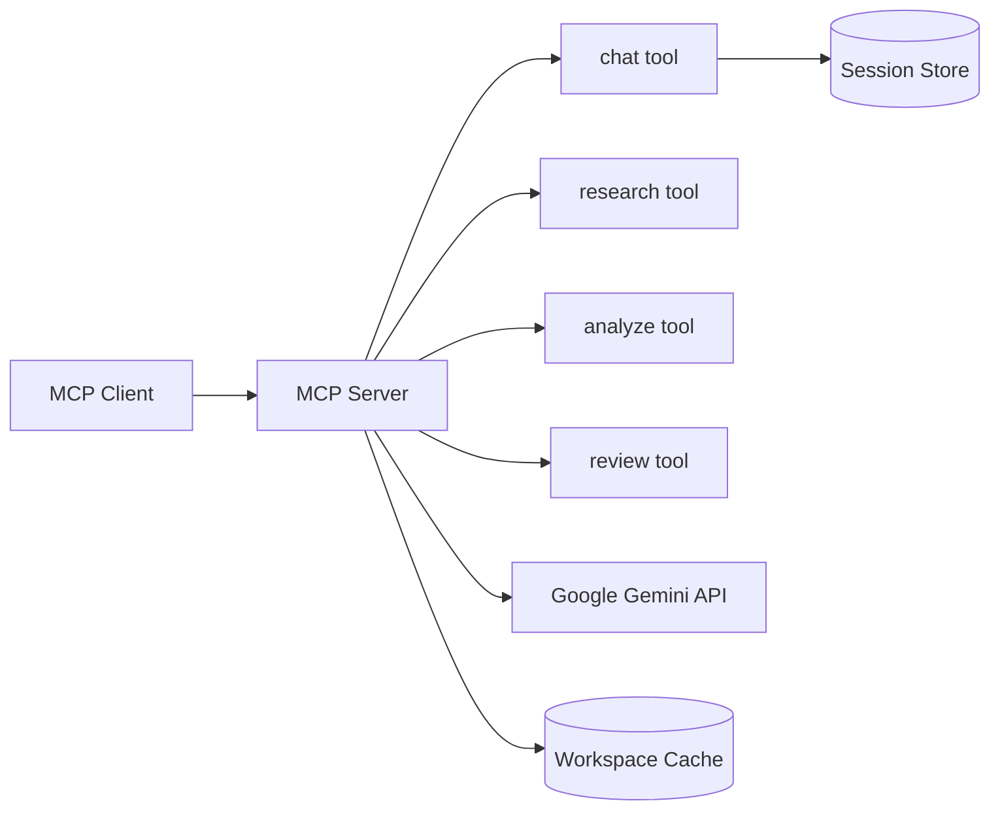

# Gemini Assistant

[](https://github.com/j0hanz/gemini-assistant/blob/master/LICENSE) [](https://github.com/j0hanz/gemini-assistant/blob/master/package.json) [](https://github.com/j0hanz/gemini-assistant/stargazers) [](https://github.com/j0hanz/gemini-assistant/commits)

[](https://nodejs.org) [](https://www.typescriptlang.org)

**Workflow-first MCP server for Google Gemini with sessions and workspace context.**

## Overview

`gemini-assistant` is an MCP server that exposes four job-first tools (`chat`, `research`, `analyze`, `review`) over Google Gemini. It manages multi-turn sessions, workspace context caching, and streaming progress notifications — giving any MCP client a structured Gemini surface with a fixed, discoverable public contract.

| Aspect       | Detail                           |
| :----------- | :------------------------------- |
| **Status**   | Active                           |
| **Language** | TypeScript (strict, ESM)         |
| **Runtime**  | Node.js `>=24`                   |
| **Package**  | npm — `@j0hanz/gemini-assistant` |
| **License**  | MIT                              |

## Highlights

| Feature                  | Description                                                                          |
| :----------------------- | :----------------------------------------------------------------------------------- |
| Job-first public surface | Four tools, three prompts, and a set of resources with a frozen, versioned contract  |
| Server-managed sessions  | Multi-turn chat with per-turn raw `Part[]` storage for replay-safe orchestration     |
| Workspace cache          | Auto-scans project files and maintains a Gemini context cache, refreshed every 2 min |
| Tool profiles            | 11 built-in profiles (`grounded`, `deep-research`, `code-math`, etc.) per tool call  |
| Streaming notifications  | Phase, finding, and thought chunks emitted as custom MCP notifications               |
| Three transports         | `stdio` (default), `http` (with bearer auth + rate limiting), `web-standard`         |

## Built With

[](https://nodejs.org) [](https://www.typescriptlang.org)

| Layer          | Technology                                                |
| :------------- | :-------------------------------------------------------- |
| AI SDK         | `@google/genai` — Google Gemini API                       |
| MCP server     | `@modelcontextprotocol/server` v2 (Streamable HTTP)       |
| HTTP transport | Express 5                                                 |
| Schema         | Zod v4 with `@cfworker/json-schema` for Gemini validation |
| Runtime        | Node.js 24, TypeScript 6 strict, ESM                      |

## Quick Start

> [!TIP]
> Get running in under 60 seconds. Requires Node.js `>=24` and a Google Gemini API key from [Google AI Studio](https://aistudio.google.com).

### Prerequisites

| Requirement    | Version / Notes                                                |
| :------------- | :------------------------------------------------------------- |
| Node.js        | `>=24`                                                         |
| npm            | Bundled with Node.js                                           |
| Gemini API key | Obtain from [aistudio.google.com](https://aistudio.google.com) |

### Install

```bash
npm install -g @j0hanz/gemini-assistant
```

Or run without installing:

```bash
npx @j0hanz/gemini-assistant
```

### Configure your MCP client

Add the server to your MCP client configuration (e.g. Claude Desktop `claude_desktop_config.json`):

```json
{
  "mcpServers": {
    "gemini-assistant": {
      "command": "npx",
      "args": ["-y", "@j0hanz/gemini-assistant"],
      "env": {
        "API_KEY": "your-gemini-api-key"
      }
    }
  }
}
```

> [!IMPORTANT]
> `API_KEY` is the only required variable. Every other setting has a safe default.

```env
# Required
API_KEY=your-google-gemini-api-key
```

## Architecture



## Tools

| Tool       | Best For                                                                                  |
| :--------- | :---------------------------------------------------------------------------------------- |
| `chat`     | Multi-turn conversation with server-managed sessions and optional Google Search grounding |
| `research` | Web-grounded lookup in `quick` (single pass) or `deep` (multi-step synthesis) mode        |
| `analyze`  | Focused analysis of a local file, public URLs, a small file set, or diagram generation    |
| `review`   | Reviewing a local diff, comparing two files, or diagnosing a failing change               |

## Prompts

| Prompt     | Purpose                                                               |
| :--------- | :-------------------------------------------------------------------- |
| `discover` | Orient a client to available jobs and recommend a starting point      |
| `research` | Package a research goal into the quick-vs-deep decision flow          |
| `review`   | Help a client frame a diff review, file comparison, or failure triage |

## Resources

| URI                                             | Returns                                             |
| :---------------------------------------------- | :-------------------------------------------------- |
| `discover://catalog`                            | Full public surface as JSON + Markdown              |
| `discover://workflows`                          | Job-first starter workflows                         |
| `discover://context`                            | Snapshot of server knowledge state                  |
| `gemini://profiles`                             | All 11 tool profiles with capability details        |
| `workspace://context`                           | Assembled workspace context with token estimate     |
| `workspace://cache`                             | Workspace cache status JSON                         |
| `session://`                                    | List of active in-memory sessions                   |
| `session://{sessionId}/transcript`              | Text transcript for one session (requires opt-in)   |
| `gemini://sessions/{sessionId}/turns/{n}/parts` | SDK-faithful `Part[]` for replay-safe orchestration |

## Project Structure

```text
gemini-assistant/
├── __tests__/
│   └── lib/
├── docs/
│   └── specs/
├── scripts/
├── src/
│   ├── lib/
│   ├── schemas/
│   ├── tools/
│   ├── catalog.ts
│   ├── client.ts
│   ├── config.ts
│   ├── index.ts
│   ├── prompts.ts
│   ├── public-contract.ts
│   ├── resources.ts
│   ├── server.ts
│   ├── sessions.ts
│   └── transport.ts
├── package.json
├── server.json
└── tsconfig.json
```

| Path                           | Purpose                                                    |
| :----------------------------- | :--------------------------------------------------------- |
| `src/public-contract.ts`       | Canonical frozen public surface: tools, prompts, resources |
| `src/server.ts`                | Constructs `McpServer`, wires all capabilities             |
| `src/sessions.ts`              | In-memory session store with raw `Part[]` per turn         |
| `src/client.ts`                | Lazy Gemini AI singleton and cost profiles                 |
| `src/lib/tool-profiles.ts`     | Resolves tool profiles and capability sets                 |
| `src/lib/workspace-context.ts` | Workspace cache manager with auto-scan and refresh         |
| `src/config.ts`                | All environment variable parsing                           |
| `src/transport.ts`             | HTTP and web-standard transport setup                      |
| `server.json`                  | MCP Registry entry for npm distribution                    |

## Configuration

> [!IMPORTANT]
> `API_KEY` is the only required variable. Every other setting has a safe default.

```env
# Required
API_KEY=your-google-gemini-api-key
```

### Core

| Variable                     | Default                  | Purpose                                                         |
| :--------------------------- | :----------------------- | :-------------------------------------------------------------- |
| `MODEL`                      | `gemini-3-flash-preview` | Gemini model to use                                             |
| `TRANSPORT`                  | `stdio`                  | Transport mode: `stdio`, `http`, or `web-standard`              |
| `THOUGHTS`                   | `false`                  | Stream Gemini thinking chunks as thought notifications          |
| `GEMINI_MAX_OUTPUT_TOKENS`   | `2048`                   | Default max output tokens per call                              |
| `GEMINI_THINKING_BUDGET_CAP` | `16384`                  | Upper cap on per-call thinking budget                           |
| `GEMINI_SAFETY_SETTINGS`     | —                        | JSON array of `{category, threshold, method?}` safety overrides |

### Transport (HTTP / web-standard)

| Variable                                  | Default     | Purpose                                                   |
| :---------------------------------------- | :---------- | :-------------------------------------------------------- |
| `MCP_HTTP_TOKEN`                          | —           | Bearer token (≥32 chars); required unless loopback exempt |
| `MCP_ALLOW_UNAUTHENTICATED_LOOPBACK_HTTP` | `false`     | Skip auth for loopback requests                           |
| `PORT`                                    | `3000`      | HTTP listen port                                          |
| `HOST`                                    | `127.0.0.1` | HTTP bind address                                         |
| `CORS_ORIGIN`                             | —           | Allowed CORS origin (`*` or a single `http(s)://` origin) |
| `MCP_HTTP_RATE_LIMIT_RPS`                 | `10`        | Requests per second per IP                                |
| `MCP_HTTP_RATE_LIMIT_BURST`               | `20`        | Burst allowance                                           |
| `STATELESS`                               | `false`     | Disable sessions and tasks capability                     |
| `MCP_TRUST_PROXY`                         | `false`     | Trust `X-Forwarded-For` headers                           |

### Sessions

| Variable                               | Default | Purpose                                                 |
| :------------------------------------- | :------ | :------------------------------------------------------ |
| `MCP_EXPOSE_SESSION_RESOURCES`         | `false` | Enable transcript, events, and raw turn-parts resources |
| `SESSION_REPLAY_MAX_BYTES`             | `50000` | Max bytes replayed into Gemini history per session      |
| `SESSION_REPLAY_INLINE_DATA_MAX_BYTES` | `16384` | Max inline data bytes replayed per part                 |
| `SESSION_EVENTS_VERBOSE`               | `false` | Emit full event payloads instead of slim summaries      |
| `GEMINI_SESSION_REDACT_KEYS`           | —       | Comma-separated regex patterns for key redaction        |

### Workspace Cache

| Variable             | Default | Purpose                                                            |
| :------------------- | :------ | :----------------------------------------------------------------- |
| `CACHE`              | `true`  | Enable Gemini context caching for workspace files                  |
| `CACHE_TTL`          | `3600s` | Cache TTL (e.g. `1800s`)                                           |
| `AUTO_SCAN`          | `true`  | Auto-scan known config files for workspace context                 |
| `CONTEXT`            | —       | Path to an explicit workspace context file                         |
| `ROOTS`              | —       | Comma-separated root paths (defaults to process working directory) |
| `ROOTS_FALLBACK_CWD` | `true`  | Fall back to `cwd` when `ROOTS` is not set                         |

### Logging

| Variable        | Default | Purpose                                            |
| :-------------- | :------ | :------------------------------------------------- |
| `LOG_DIR`       | —       | Directory for file-based log output                |
| `LOG_TO_STDERR` | `false` | Write logs to stderr instead of a file             |
| `LOG_PAYLOADS`  | `false` | Log full request/response payloads                 |
| `REVIEW_DOCS`   | —       | Comma-separated paths injected into review context |

## Scripts

| Command                          | Description                                                  |
| :------------------------------- | :----------------------------------------------------------- |
| `node scripts/tasks.mjs`         | Full check suite: format → lint/type-check/knip → test/build |
| `node scripts/tasks.mjs --fix`   | Auto-fix format/lint/knip, then verify                       |
| `node scripts/tasks.mjs --quick` | Skip test + rebuild (format/lint/type-check/knip only)       |
| `node scripts/tasks.mjs --llm`   | Emit structured failure detail to stdout                     |
| `npm run build`                  | Compile TypeScript to `dist/`                                |
| `npm run test`                   | Run all `*.test.ts` files with Node built-in runner          |
| `npm run lint`                   | ESLint check (fails on any warning)                          |
| `npm run format`                 | Prettier write                                               |
| `npm run type-check`             | TypeScript type check without emit                           |
| `npm run knip`                   | Detect unused exports, files, and dependencies               |
| `npm run inspector`              | Build and launch MCP Inspector for interactive testing       |

## Security

> [!IMPORTANT]
> Report vulnerabilities privately via [GitHub Security Advisories](https://github.com/j0hanz/gemini-assistant/security/advisories/new). Do not open public issues for security reports.

This server handles API keys and session data. Sensitive field names in session history are automatically redacted before replay. HTTP transport enforces bearer authentication and per-IP rate limiting by default.

## Contributing

1. Fork the repository.
2. Create a feature branch — `git checkout -b feat/x`.
3. Commit your changes with a clear message.
4. Run `node scripts/tasks.mjs` and confirm all checks pass.
5. Open a pull request.

[](https://github.com/j0hanz/gemini-assistant/graphs/contributors)

## License

Released under the MIT License. See [LICENSE](LICENSE) for details.

---

[Back to top](#gemini-assistant)
